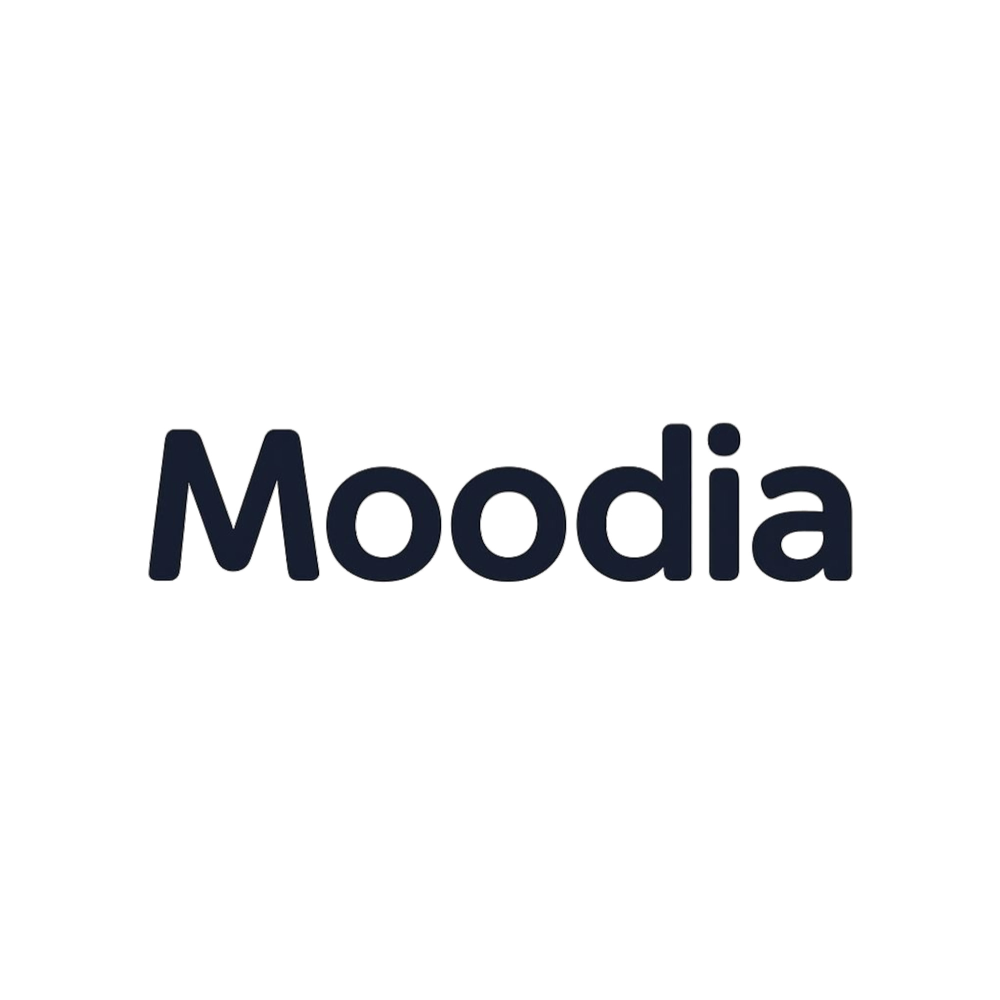

<div align="center">
  
  <h1>Moodia</h1>
  <p><em>La red social que humaniza la interacción digital</em></p>
  
  
  
  
</div>

---

## 🌟 ¿Qué es Moodia?

Moodia es una **red social innovadora** que pone el foco en **el proceso personal y emocional** en lugar del resultado final. Un espacio donde los usuarios comparten de forma auténtica sus vivencias, emociones y procesos creativos, deportivos, laborales o de desarrollo personal.

### 💡 Objetivo Central

Crear una comunidad digital basada en la **autenticidad, el valor real y el impacto positivo**, donde los usuarios se conecten desde sus emociones y procesos diarios, no desde la apariencia ni la competencia superficial.

### 🎯 Visión

Ser la red social que **humaniza la interacción digital**, priorizando el crecimiento personal, la inspiración mutua, y la colaboración consciente entre personas de todos los ámbitos.

## 🚀 Inicio Rápido

### Prerrequisitos
- Node.js 18+
- npm o yarn
- Expo CLI: `npm install -g @expo/cli`

### 🌐 Versión Web
```bash
cd moodia-web
npm install
npm run dev
```

### 📱 Versión Móvil
```bash
cd moodia-mobile
npm install
npm start
```

## 🛠️ Stack Tecnológico

<div align="center">

| Categoría | Web | Móvil |
|-----------|-----|-------|
| **Framework** | Next.js 14 | React Native + Expo |
| **Lenguaje** | TypeScript | TypeScript |
| **Estilos** | TailwindCSS | StyleSheet |
| **Animaciones** | Framer Motion | React Native Reanimated |
| **Backend** | Firebase | Firebase |
| **Base de Datos** | Firestore | Firestore |
| **Autenticación** | Firebase Auth | Firebase Auth |
| **Storage** | Firebase Storage | Firebase Storage |

</div>

## ✨ Características Principales

### 🎯 1. Selector de Mood Diario

<div align="center">

| Mood | Emoji | Color | Descripción |
|------|-------|-------|-------------|
| **Focus** | 🎯 | `#3A86FF` | Concentración y productividad |
| **Creativo** | 🌈 | `#FF5E9C` | Inspiración y creatividad |
| **Explorador** | 🔍 | `#00C897` | Descubrimiento y aprendizaje |
| **Reflexivo** | 💭 | `#9B5DE5` | Contemplación y análisis |
| **Chill** | 😎 | `#70D6FF` | Relajación y tranquilidad |
| **Relax** | 😴 | `#D3D3E7` | Descanso y pausa |
| **Motivado** | 🔥 | `#FF6B6B` | Energía y determinación |

</div>

> **"¿Cómo te sentís hoy?"** - Este mood define el feed y la experiencia del usuario.

### 📱 2. Feed Personalizado por Mood

- **Diseño**: Estilo Pinterest/Instagram optimizado
- **Contenido**: Imagen/video/texto con contexto emocional
- **Filtrado inteligente**: Basado en tu mood actual
- **Sin scroll infinito**: Experiencia consciente y limitada

### ✍️ 3. Publicación de Procesos

- **Título** + descripción del proceso
- **Mood** del momento (auto-seleccionado)
- **Contexto emocional**: "¿Por qué compartís esto?"
- **Multimedia**: Imagen/video/audio/texto
- **Enfoque**: El proceso, no el resultado

### 💝 4. Sistema de Reacciones Emocionales

<div align="center">

| Reacción | Emoji | Significado |
|----------|-------|-------------|
| **Me encanta** | ❤️ | Conexión emocional profunda |
| **Apoyo esto** | 🙌 | Solidaridad y respaldo |
| **Me aporta** | 🎯 | Valor práctico o útil |
| **Me inspira** | 🧠 | Motivación y creatividad |
| **Aprendí algo** | 📚 | Conocimiento adquirido |
| **Quiero compartir** | 🔁 | Impulso de difundir |

</div>

> **Sin likes tradicionales** - Feedback emocional y funcional real

## 🚫 Filosofía Anti-Adicción

<div align="center">

| ❌ **NO Tenemos** | ✅ **SÍ Tenemos** |
|-------------------|-------------------|
| Likes simples | Reacciones emocionales |
| Scroll infinito | Feed limitado y consciente |
| Notificaciones adictivas | Interacciones significativas |
| Influencers vacíos | Procesos auténticos |
| Contenido viral sin valor | Impacto real y crecimiento |

</div>

## 🎨 Identidad Visual

### Paleta de Colores
```css
/* Colores Principales */
--primary-purple: #7B5BFF;
--primary-pink: #FF5E9C;
--primary-orange: #FFAB5E;

/* Neutrales */
--neutral-white: #FAFAFA;
--neutral-navy: #1E1E2F;
--neutral-light: #F0F0F5;
```

### Tipografías
- **Headers**: Poppins (moderna, redondeada)
- **Body**: Inter (limpia, legible)

### Elementos de Diseño
- **Bordes**: Redondeados (20px)
- **Gradientes**: Purple → Pink
- **Sombras**: Suaves y difusas
- **Animaciones**: Fluidas con Framer Motion

## 🔮 Roadmap Futuro

### Fase 2 - Comunidad
- [ ] Grupos temáticos por mood
- [ ] Mensajería inteligente
- [ ] Eventos y retos semanales

### Fase 3 - IA & Personalización
- [ ] Asistente IA emocional
- [ ] Recomendaciones por mood
- [ ] Mood Streaks y gamificación

### Fase 4 - Ecosistema
- [ ] Integración con Spotify
- [ ] Marketplace consciente
- [ ] Modo offline/diario personal

## 📋 Estado Actual del MVP

### ✅ **Funcionalidades Implementadas**

- [x] **Selector de Mood Diario** - 7 opciones emocionales
- [x] **Feed Filtrado por Mood** - Contenido personalizado
- [x] **Sistema de Reacciones** - 6 tipos de feedback emocional
- [x] **Publicación de Procesos** - Título, descripción, contexto
- [x] **Identidad Visual Completa** - Logo, colores, tipografías
- [x] **Responsive Design** - Web y móvil optimizados

### 🔄 **En Desarrollo**

- [ ] Autenticación Firebase
- [ ] Subida de imágenes
- [ ] Perfil de usuario
- [ ] Persistencia de datos
- [ ] Notificaciones push

## 📁 Estructura del Proyecto

```
Moodia-2/
├── 📱 moodia-mobile/          # React Native + Expo
│   ├── src/
│   │   ├── components/        # Componentes UI
│   │   ├── screens/          # Pantallas principales
│   │   └── types/            # Tipos TypeScript
│   └── App.tsx               # Aplicación principal
│
├── 🌐 moodia-web/            # Next.js 14
│   ├── app/                  # App Router
│   ├── components/           # Componentes reutilizables
│   ├── lib/                  # Configuración Firebase
│   ├── types/                # Tipos TypeScript
│   └── public/               # Assets estáticos
│
├── 🖼️ images/                # Logos y assets
└── 📚 README.md              # Este archivo
```

## 🔧 Configuración Firebase

1. **Crear proyecto** en [Firebase Console](https://console.firebase.google.com)
2. **Habilitar Authentication** (Google/Email)
3. **Crear Firestore Database** (modo prueba)
4. **Configurar Storage** para imágenes
5. **Copiar configuración** a `.env.local`

```bash
# moodia-web/.env.local
NEXT_PUBLIC_FIREBASE_API_KEY=tu_api_key
NEXT_PUBLIC_FIREBASE_AUTH_DOMAIN=tu_proyecto.firebaseapp.com
NEXT_PUBLIC_FIREBASE_PROJECT_ID=tu_project_id
# ... resto de variables
```

## 🤝 Contribuir

¿Querés ser parte de Moodia? 

1. **Fork** el proyecto
2. **Crea** una rama para tu feature (`git checkout -b feature/AmazingFeature`)
3. **Commit** tus cambios (`git commit -m 'Add some AmazingFeature'`)
4. **Push** a la rama (`git push origin feature/AmazingFeature`)
5. **Abre** un Pull Request

## 📄 Licencia

Este proyecto está bajo la Licencia MIT - ver el archivo [LICENSE](LICENSE) para detalles.

## 💬 Contacto

**Moodia Team** - La red social más humana del mundo

---

<div align="center">
  <p><strong>Moodia</strong> - Donde <em>ser, sentir y compartir</em> tienen prioridad sobre aparentar</p>
  <p>🌟 <strong>El proceso es el protagonista</strong> 🌟</p>
</div>